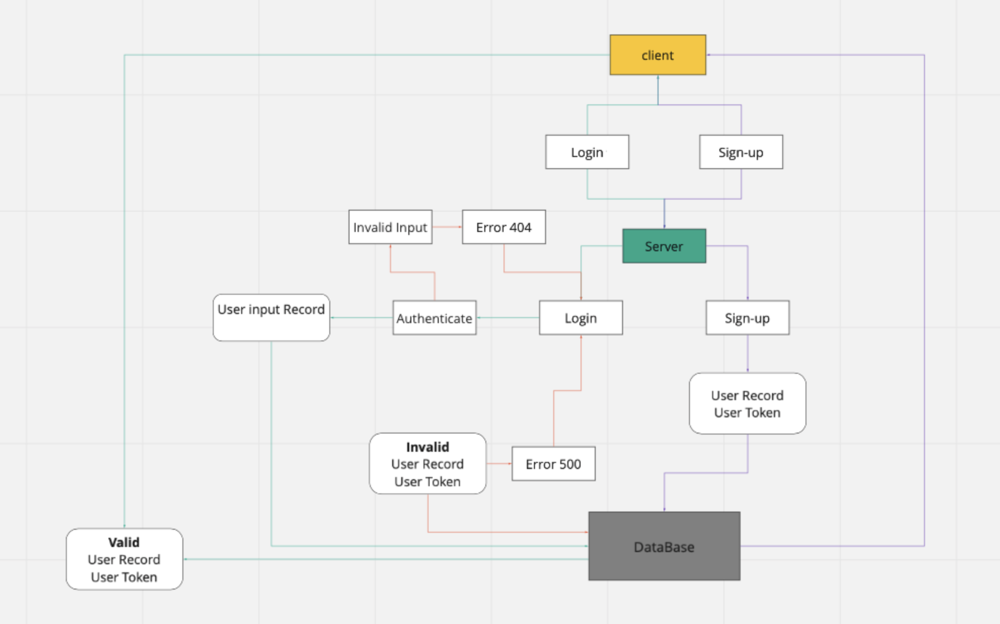

# baerer-auth

Express Server
Created by Jacob Gregor

## Installation\

npm install\

"dependencies": {
"base-64": "^1.0.0",
"bcrypt": "^5.0.0",
"cors": "^2.8.5",
"dotenv": "^8.2.0",
"express": "^4.17.1",
"jest": "^26.6.3",
"jsonwebtoken": "^8.5.1",
"morgan": "^1.10.0",
"pg": "^8.6.0",
"sequelize": "^6.6.2",
"sequelize-cli": "^6.2.0",
"sqlite3": "^5.0.2",
"supertest": "^6.1.3"
},\

.env{
PORT=3000
NODE_ENV=test
SECRET=secret
}

## Summary of Problem Domain\

## lab-07: Technical Requirements / Notes

Authentication Server Phase 2: Token (Bearer) Authentication\

At this point, our auth-server is able to allow a user to create an account as well as to handle Basic Authentication (user provides a username + password). When a “good” login happens, the user is considered to be “authenticated” and our auth-server generates a JWT signed “Token” which is returned to the application\

We will now be using that Token to re-authenticate users to shield access to any route that requires a valid login to access.\

## Links to application deployment\

Heroku: https://bearer-auth-jacob.herokuapp.com
GitHub: https://github.com/Code-Fellows-401/baerer-auth
GitHub PR: https://github.com/Code-Fellows-401/baerer-auth/pulls?q=is%3Apr+is%3Aclosed

## Embedded UML\

WhiteBaord for Lab-04:
\

## Routes Used\

Path: /signup
responds with an { Object } with a key: value pair as follows -> {name: 'Name Here'}.\
HTTP GET

authRouter.post('/signup', async (req, res, next) => {
try {
let userRecord = await users.create(req.body);
const output = {
user: userRecord,
token: userRecord.token,
};
res.status(201).json(output);
} catch (e) {
next(e.message);
}
});

Path: /signin
Verifies User information with a given Username & PAssword, fetches said information and validated its authenticity. Returns user information if(valid), else throws errors.

authRouter.post('/signin', basicAuth, (req, res, next) => {
let user = {
user: req.user,
token: req.user.token,
};
res.status(200).json(user);
});

Path: /users
Fetches All user data and Maps(users) from our database.

authRouter.get('/users', bearerAuth, async (req, res, next) => {
const user = await users.findAll({});
const list = user.map((user) => user.username);
console.log(list);
res.status(200).json(list);
});

Path: /secret
Secret Area redirect

authRouter.get('/secret', bearerAuth, async (req, res, next) => {
res.status(200).send('Welcome to the secret area!');
});
